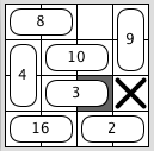

# Wartsila Test Assignment

This repository contains C# solutions for three programming tasks from the Wärtsilä Senior Developer technical assignment.

The solutions were prepared as a console application.
Each problem reads from standard input and writes to standard output, following the Kattis-style execution model.
Local helper tests are included in the source code to make the behavior easy to verify and review.

## Background

The assignment was provided through the Kattis online problem-solving tool and consisted of three tasks:

- Easy: Problem A
- Medium: Problem B
- Hard: Problem C

Due to an issue with the Kattis submission flow, only the first problem was submitted through the platform before access was locked.
The remaining implementation, task descriptions, explanations, local tests, and test results are preserved in this repository for review.

## Project Structure

```text
Source/
  Project Background.txt
  Tast-1-Description.txt
  Tast-2-Description.txt
  Tast-3-Description.txt
  Tast-3-Description-Image-1.png
  Tast-Results.txt

Wartsila.TestApp.TestConsole/
  ProblemA.cs
  ProblemB.cs
  ProblemC.cs
  Program.cs
```

## Problem A - Apaxian Name Compaction

### Underlying Problem

The input is a single lowercase name. Some letters may appear multiple times in a row, and each consecutive group of the same letter should be shortened to only one occurrence.

For example, `rooobert` becomes `robert`, because the consecutive `ooo` group is replaced by a single `o`. The relative order of different letters must stay unchanged.

### Solution

The solution processes the name from left to right and keeps track of the previously processed character.
For each character, it appends it to the result only if it is different from the previous character.

This removes only adjacent duplicates while preserving all meaningful character changes.

Time complexity: `O(n)`, where `n` is the length of the name.

Space complexity: `O(n)` in the worst case, when no characters are duplicated.

For demonstration purposes, two implementation strategies are included:

- a simple regular-expression based version, which is concise and easy to read;
- an optimized single-pass version, which avoids regular expression overhead and is better suited for performance-sensitive execution.

Small helper methods are also included for input validation and simple local testing.

### Input

The input contains a single name. Each name contains only lowercase letters `a-z`, no whitespace, a minimum length of 1 character, and a maximum length of 250 characters.

### Output

The compact version of the name.

### Examples

```text
Input:
robert

Output:
robert
```

```text
Input:
rooobert

Output:
robert
```

```text
Input:
roooooobertapalaxxxxios

Output:
robertapalaxios
```

### Test Results

<details>
<summary>Problem A local test output</summary>

```text
----- ProblemA -----
Test PASSED: expected="robert", result="robert", input=="robert".
Test PASSED: expected="robert", result="robert", input=="rooobert".
Test PASSED: expected="robertapalaxios", result="robertapalaxios", input=="roooooobertapalaxxxxios".
Test PASSED: expected="robert", result="robert", input=="robert".
Test PASSED: expected="robert", result="robert", input=="rooobert".
Test PASSED: expected="robertapalaxios", result="robertapalaxios", input=="roooooobertapalaxxxxios".
------------------
```

</details>

## Problem B - Minimum Changes to Palindrome

### Underlying Problem

The task is to determine the minimum number of operations needed to transform a given string into a palindrome.

In one operation, it is possible either to change an existing character or to append one new character to the end of the string. The goal is not to build every possible string, but to find the smallest number of required operations.

### Solution

The solution checks how many character pairs do not match when comparing the string from both ends.
Each mismatch can be fixed with one replacement.

To also support append operations, the solution tries possible extended versions of the string using placeholder characters.
A placeholder represents an appended character that can later be chosen optimally.

For every candidate length, the same pair comparison is used, and the minimum number of required operations is selected.

Additional helper methods are included for palindrome checking, demonstration output, and simple test coverage.

### Input

The input is the chosen name.

Limits:

- length is at least 1 and at most 100 characters;
- the name consists only of lowercase letters `a-z`.

### Output

The number of changes needed to make the name a palindrome.

### Examples

```text
Input:
kaia

Output:
1
```

```text
Input:
abcdefgded

Output:
4
```

### Test Results

<details>
<summary>Problem B local test output</summary>

```text
----- ProblemB -----
Test PASSED: expected="1", result="1", input=="kaia".
Test PASSED: result="True", input=="kaia", comment="kaiak".
Test PASSED: expected="4", result="4", input=="abcdefgded".
Test PASSED: result="True", input=="abcdefgded", comment="abcdefedcba".
Test PASSED: expected="0", result="0", input=="a".
Test PASSED: result="True", input=="a", comment="a".
Test PASSED: expected="0", result="0", input=="aa".
Test PASSED: result="True", input=="aa", comment="aa".
Test PASSED: expected="1", result="1", input=="ab".
Test PASSED: result="True", input=="ab", comment="aa".
Test PASSED: expected="0", result="0", input=="aba".
Test PASSED: result="True", input=="aba", comment="aba".
Test PASSED: expected="1", result="1", input=="abc".
Test PASSED: result="True", input=="abc", comment="aba".
Test PASSED: expected="2", result="2", input=="abcd".
Test PASSED: result="True", input=="abcd", comment="abba".
Test PASSED: expected="2", result="2", input=="abcde".
Test PASSED: result="True", input=="abcde", comment="abcba".
Test PASSED: expected="3", result="3", input=="abcdef".
Test PASSED: result="True", input=="abcdef", comment="abccba".
Test PASSED: expected="3", result="3", input=="abcdefg".
Test PASSED: result="True", input=="abcdefg", comment="abcdcba".
Test PASSED: expected="0", result="0", input=="zzzz".
Test PASSED: result="True", input=="zzzz", comment="zzzz".
Test PASSED: expected="1", result="1", input=="zzzy".
Test PASSED: result="True", input=="zzzy", comment="zzzz".
Test PASSED: expected="1", result="1", input=="abca".
Test PASSED: result="True", input=="abca", comment="abba".
Test PASSED: expected="1", result="1", input=="abcda".
Test PASSED: result="True", input=="abcda", comment="abcba".
Test PASSED: expected="1", result="1", input=="aab".
Test PASSED: result="True", input=="aab", comment="aaa".
Test PASSED: expected="2", result="2", input=="aabc".
Test PASSED: result="True", input=="aabc", comment="aaaa".
Test PASSED: expected="0", result="0", input=="abcba".
Test PASSED: result="True", input=="abcba", comment="abcba".
Test PASSED: expected="1", result="1", input=="abccbx".
Test PASSED: result="True", input=="abccbx", comment="abccba".
Test PASSED: expected="5", result="5", input=="abcdefghij".
Test PASSED: result="True", input=="abcdefghij", comment="abcdeedcba".
Test PASSED: expected="1", result="1", input=="abab".
Test PASSED: result="True", input=="abab", comment="ababa".
Test PASSED: expected="2", result="2", input=="abac".
Test PASSED: result="True", input=="abac", comment="abba".
Test PASSED: expected="2", result="2", input=="abcab".
Test PASSED: result="True", input=="abcab", comment="abcba".
Test PASSED: expected="1", result="1", input=="aaaaab".
Test PASSED: result="True", input=="aaaaab", comment="aaaaaa".
------------------
```

</details>

## Problem C - Car Lot Move Sequence

### Underlying Problem

The task is to find the shortest sequence of car moves needed to uncover a target grid cell in a parking lot.

Each car occupies two adjacent cells and can move only forward or backwards along its orientation. The grid also contains one empty cell and possibly blocked cells.

If several shortest solutions exist, the one with the smallest car number at the first differing move is selected. If the target cannot be uncovered, the result is `impossible`.

### Solution

The solution models the problem as a graph search.

Instead of storing every full parking-lot state, each graph node represents the position of the empty cell.
Moving a car transfers the empty cell from one side of that car to the other, so every valid car move becomes a graph edge labelled with the car number.

The graph is built from all cars and valid movement directions, ignoring blocked or out-of-grid positions.

Possible moves are sorted by car number before the breadth-first search.
This search prefers smaller car numbers when several shortest answers are possible.

A breadth-first search is then applied to find the shortest path from the initial empty cell to the target cell, and the stored path state is used to restore the required sequence of car moves.

### Illustration



Figure 1: sample lot where cars `8`, `4`, and `3` must be moved, in that order, to uncover the target cell.

### Input

The input starts with two positive integers `m` and `n`, where `m, n <= 250`, indicating the number of rows and columns of the junk car lot.

The next `m` lines contain `n` integers each:

- a non-negative value identifies one half of a car;
- each car number appears exactly twice;
- the two cells of a car are horizontally or vertically adjacent;
- `-1` is the only empty grid location;
- `-2` is a blocked location.

The final line contains the row and column of the target location to uncover.

### Output

Display the car numbers that must be moved, separated by spaces, in the order in which they must be moved.

If no solution exists, display:

```text
impossible
```

### Examples

```text
Input:
4 4
8 8 -1 9
4 10 10 9
4 3 3 -2
16 16 2 2
3 3

Output:
8 4 3
```

```text
Input:
4 4
8 8 -2 9
4 10 10 9
4 3 3 -1
16 16 2 2
3 3

Output:
impossible
```

### Test Results

<details>
<summary>Problem C local test output</summary>

```text
----- ProblemC -----
Test PASSED: expected="8 4 3", result="8 4 3", input=="4 4
8 8 -1 9
4 10 10 9
4 3 3 -2
16 16 2 2
3 3".
Test PASSED: expected="impossible", result="impossible", input=="4 4
8 8 -2 9
4 10 10 9
4 3 3 -1
16 16 2 2
3 3".
Test PASSED: expected="1", result="1", input=="1 3
-1 1 1
1 3".
Test PASSED: expected="1", result="1", input=="1 3
1 1 -1
1 1".
Test PASSED: expected="2", result="2", input=="3 1
-1
2
2
3 1".
Test PASSED: expected="2", result="2", input=="3 1
2
2
-1
1 1".
Test PASSED: expected="1 2", result="1 2", input=="1 5
-1 1 1 2 2
1 5".
Test PASSED: expected="2 1", result="2 1", input=="1 5
1 1 2 2 -1
1 1".
Test PASSED: expected="impossible", result="impossible", input=="1 4
-1 1 1 -2
1 2".
Test PASSED: expected="1", result="1", input=="1 4
-1 1 1 -2
1 3".
Test PASSED: expected="1 3", result="1 3", input=="3 3
-1 1 1
2 2 3
4 4 3
3 3".
------------------
```

</details>

## Implementation Notes

- The code is intentionally kept in a console project to match the expected online judge format.
- Helper methods and local tests are included to make the implementation easier to review during the interview process.
- The source files contain the actual implementations and additional comments explaining the main classes and public methods.
